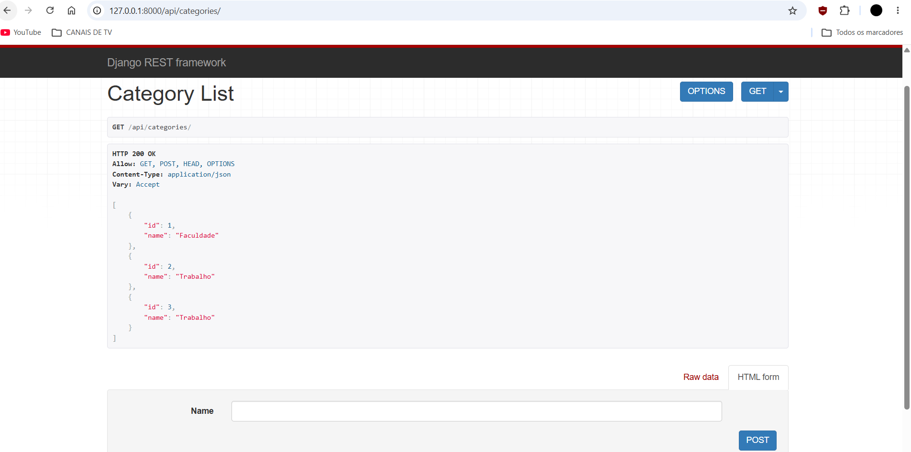
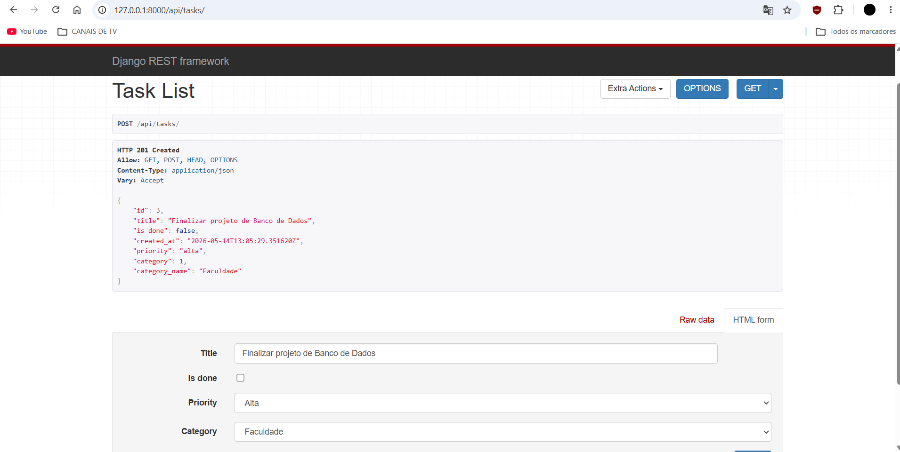
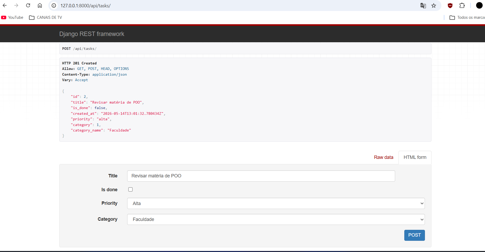
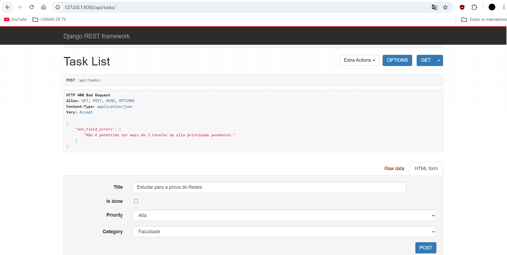
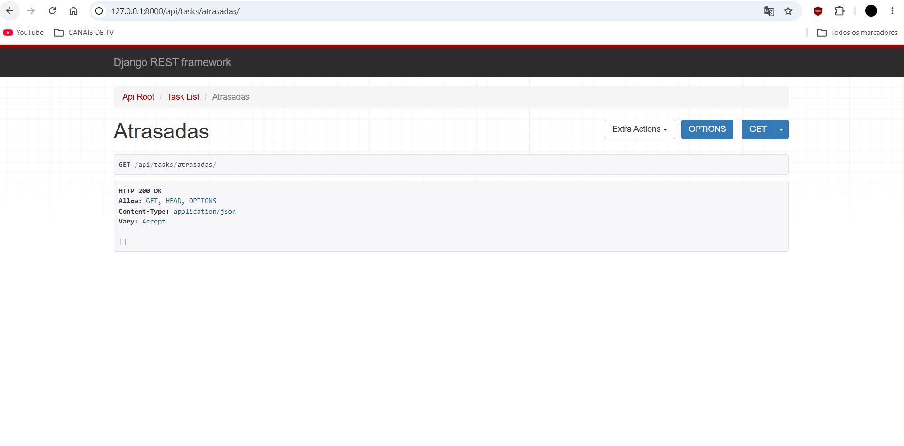

# Task Manager API - TODO LIST

Este projeto é uma API REST para gerenciamento de tarefas, desenvolvida como parte de uma atividade acadêmica utilizando **Django** e **Django Rest Framework (DRF)**.

---

# Como Executar o Projeto

## 1. Ative o ambiente virtual

### Windows
```bash
venv\Scripts\activate
```

### Linux/Mac
```bash
source venv/bin/activate
```

---

## 2. Instale as dependências

```bash
pip install django djangorestframework
```


## 3. Aplique as migrações (Banco de Dados)

```bash
python manage.py migrate
```


## 4. Inicie o servidor

```bash
python manage.py runserver
```


# Endpoints Disponíveis

## Categorias
`/api/categories/`

- Listagem de categorias
- Criação de categorias

## Tarefas
`/api/tasks/`

- Listagem de tarefas
- Criação de tarefas

## Tarefas Atrasadas
`/api/tasks/atrasadas/`

- Filtra tarefas pendentes
- Exibe tarefas com mais de 7 dias

---

## Demonstração da API

### Listagem de Categorias


### Listagem de Tarefas (Desafio 01)


### Listagem de Tarefas (Desafio 01)


### Erro de Validação (Desafio 03)


### Endpoint de Tarefas Atrasadas (Desafio 02)

---

# Desafios Implementados

### 01. Model Category
- Relacionamento `ForeignKey`
- Exibição do nome da categoria no serializer

### 02. Tarefas Atrasadas
- Action customizada para tarefas com `is_done=False`

### 03. Validação
- Limite de 3 tarefas de prioridade `alta` não concluídas

### 04. Documentação
- Guia completo de uso da API

---

# Desenvolvedores

- Gabriel Felipe
- Guilherme Felipe
